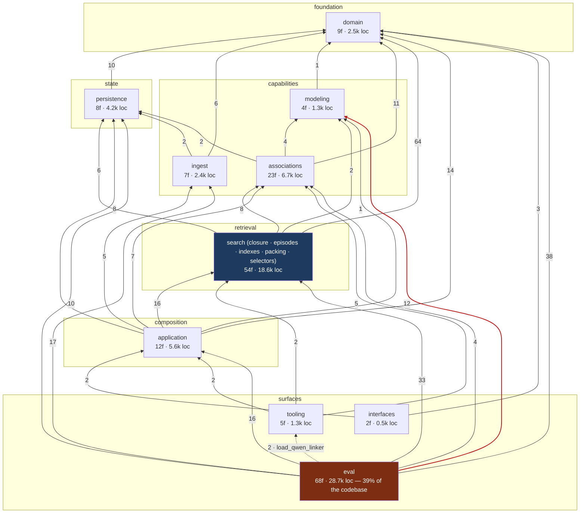

# Package dependency map — measured, not asserted

**Status**: CURRENT — regenerate on structural change
**Date**: 2026-08-19 (after the round-2 phase-2 dead-surface deletions and the `search → eval` inversion fix)
**Method**: AST walk over `src/memory_condense`, counting `from memory_condense.X import …` statements aggregated to package level. Edge labels are import-statement counts — a proxy for coupling mass, not call frequency. Rerun with the snippet at the bottom; do not hand-edit the numbers.

## The map



(Minor edges omitted for legibility: `tooling → modeling/domain/persistence` ≤3 each. Full edge list regenerates below.)

## What the measurement says

1. **The graph is a strict DAG.** The one upward edge that existed —
   `search.selectors.causal_choice_scorer → eval.local_qwen` for a dtype
   resolver — was inverted on 2026-08-19 by moving
   `resolve_local_qwen_dtype` to `modeling/qwen_dtype.py` (its declared
   responsibility home), with `eval.local_qwen` re-exporting so import and
   monkeypatch surfaces are unchanged.
2. **`eval` is 39% of the codebase** (28.7k of 72.6k loc, 68 files) and
   imports every other layer. It is a harness, so high fan-out is expected —
   but at 1.5× the size of the entire retrieval layer it is where
   simplification rounds keep finding their mass (rounds 1–2 target ~2.3k
   lines there). Watch the `diffuse_*` family: 10 files, three of the twelve
   largest modules in the repo.
3. **One smell survives, flagged not fixed**: `eval → tooling` (dashed red) —
   `consolidation_replay` and `runtime_controls` import `load_qwen_linker`
   from `tooling.qwen_consolidation`. `tooling` is a surface layer; a loader
   two surface modules depend on belongs in `associations` or `modeling`.
   Same shape as the dtype case, author call on the destination.
4. **`domain` earns its name**: 61% of all cross-package imports point at it
   or `persistence`, and it imports nothing but the standard library plus one
   `modeling` exception… none — `domain` has zero outbound edges. Helpers the
   audit routes there (`file_sha256`, `weighted_fair_order`, round-robin)
   keep that property; nothing else may move in that direction.
5. **Deleted this pass** (audit §C, verified zero-caller by grep and by the
   audit's dynamic-access sweep): `search_heat_associative` +
   `expand_heat_associative` + `search_hebbian`
   (`application/retrieval_workflow`, −168 lines incl. the now-unused
   `expand_heat_diffusion_results` import — the engine function itself stays
   live via `tooling.experiment_rig` and the root lazy exports),
   `QwenLiveHeadMemory.retrieve_candidates` (−54),
   `QwenMemoryLinker.link_into_graph` (−22, plus its
   `HeadAssociationGraph` import). Architecture overview and Theory 02
   corrected in the same change.

## Regenerate

```python
# python - <<'PY'  (from repo root)
import ast, os
from collections import defaultdict
edges = defaultdict(int)
for root, dirs, fs in os.walk("src/memory_condense"):
    dirs[:] = [d for d in dirs if d != "__pycache__"]
    for f in fs:
        if not f.endswith(".py"): continue
        p = os.path.join(root, f).replace("\\", "/")
        rel = p[len("src/memory_condense")+1:-3].replace("/", ".")
        pkg = rel.split(".")[0] if "." in rel else "(root)"
        try: tree = ast.parse(open(p, encoding="utf-8").read())
        except SyntaxError: continue
        for n in ast.walk(tree):
            if isinstance(n, ast.ImportFrom) and n.module and n.module.startswith("memory_condense"):
                t = (n.module[len("memory_condense."):] or "(root)").split(".")[0]
                if t != pkg: edges[(pkg, t)] += 1
for (a, b), c in sorted(edges.items(), key=lambda kv: -kv[1]):
    print(f"{a} -> {b}: {c}")
```
