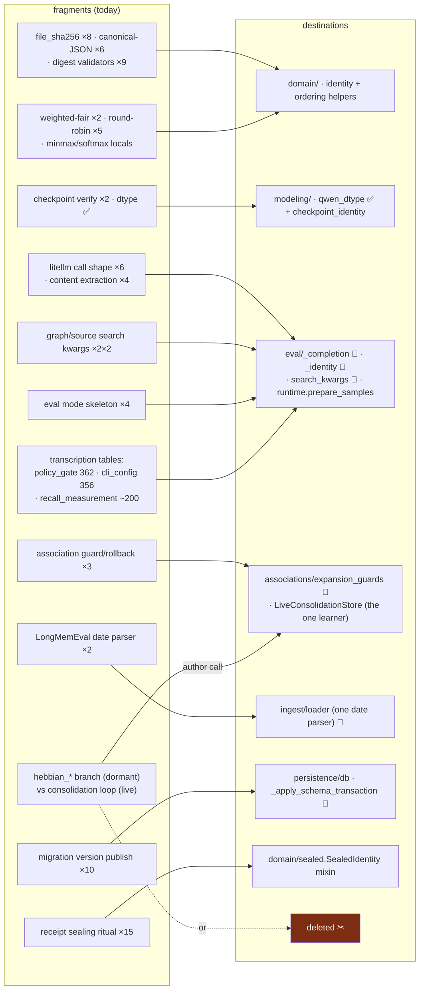

# Consolidation map — every fragment and its destination

**Status**: Living Document — update the status column as work lands
**Date**: 2026-08-19
**Companions**: [`07 - Status Reports/2026-08-19_simplification-audit-round-2.md`](../07%20-%20Status%20Reports/2026-08-19_simplification-audit-round-2.md) (the findings), [`03 - Architecture/04 - Package Dependency Map.md`](../03%20-%20Architecture/04%20-%20Package%20Dependency%20Map.md) (the measured graph)
**Statuses**: ✅ committed · 🚧 in flight (working tree, uncommitted — verified by grep 2026-08-19) · ⬜ open · 🟡 author call

The audit lists findings; this map lists **destinations**. One row per mechanism that today exists in more than one place (or in zero used places), with where it consolidates to. When every row is ✅, the codebase has exactly one implementation of each idea.

## The map

## Rows, by destination

### → `domain/` (helpers with zero outbound edges — keep that property)

| fragments | destination | status |
| --- | --- | --- |
| `weighted-fair source ordering ×2 (heat_diffusion / expansion_ordering, divergent: token clip + per-turn-vs-per-source grouping)` | `domain/ranking.weighted_fair_order` | 🚧 (A2 — helper exists; verify both callers switched) |
| `file_sha256 ×8 (two read strategies, two same-named publics)` | one `domain` canonical (keep `readinto`) | ⬜ (B17b) |
| canonical-JSON digest ×6 (4 variants; NaN handling differs) | `domain/_discourse_identity.canonical_json` | ⬜ (B18) |
| sha-digest validator ×9 (case policy split 3 ways) + exact-int ×5 names | `eval/_identity` re-exporting the domain validator | 🚧 (A9 — `eval/_identity.py` exists; adoption unverified) |
| round-robin/interleave ×5 (3 stall semantics) | move `graph_workflow._round_robin_unique` down; wrappers | ⬜ (B19) |
| `min_max_normalize` / softmax locals | parameterized `domain` helpers | ⬜ (B22) |
| `_cosine` ×2 (transition_policy/replay) | existing import path | ⬜ (B22) |

### → `modeling/`

| fragments | destination | status |
| --- | --- | --- |
| Qwen dtype resolver (was the one `search→eval` inversion) | `modeling/qwen_dtype` (eval re-exports) | ✅ `f677eae` |
| checkpoint-verification protocol ×2 (`qwen_prefix` / `embedding`) | `modeling/checkpoint_identity` | ⬜ (B17) |
| `load_qwen_linker` home (today `eval → tooling`, the last flagged edge) | `associations/` or `modeling/` | 🟡 destination is an author call |

### → `eval/` internal helpers

| fragments | destination | status |
| --- | --- | --- |
| litellm call construction ×6 + content extraction ×4 (codex temperature guard in 1 of 6; unguarded `.strip()`) | `eval/_completion.build_completion_request` + `_content` | 🚧 (A5 — adopted by judge/responder/provider_runtime; check remaining sites) |
| graph/source search-kwargs byte-clones (benchmark ↔ recall_assembly, 34+23 kwargs) | `eval/search_kwargs` | 🚧 (A7 — both callers import it) |
| eval-mode orchestration skeleton ×4 (stress-offset divergence) | `runtime.prepare_samples` + context manager | ⬜ (A10) |
| hand-written 124-col CSV vs 126-field model | `DictWriter` over `model_dump` (pattern already in-file) | ⬜ (A6) |
| receipt sealing ritual ×15 (~812 lines; 4 payloads = the reflective default retyped) | `domain/sealed.SealedIdentity` mixin | ⬜ (B12 — **gate: persisted digests proven byte-identical**) |
| transcription tables: `policy_gate` 362 → ~60, `cli_config` 356 → ~150, `recall_measurement` ~200 → ~50 | field-table + `getattr`/`model_fields` loops | ⬜ (B13–B15 — serialized identity must not change) |
| `RepresentativePolicyFactory` name collision (two publics, one name) | rename the class | ⬜ (B23) |

### → `associations/` — and the one system-level decision

| fragments | destination | status |
| --- | --- | --- |
| guard/rollback preamble ×3 (`direct_tokens` denominator differs per arm) | `associations/expansion_guards.ExpansionGuards` | 🚧 (A11 — all three arms import it) |
| **co-access learning exists twice**: dormant `hebbian_*` branch (zero production callers — `expand_hebbian`/`observe_retrieval_access` are test-only since the caller-less `search_hebbian` was deleted in `f677eae`) vs the **live** consolidation loop (`build_context` reads and writes `LiveConsolidationStore` by default) | consolidation loop is the mechanism of record; hebbian branch **deleted** (code + tests; tables can stay for state archaeology) *or* explicitly quarantined as experimental in the package map | 🟡 **the largest single author call** (~2 modules, store mixin, 3 tables, tests; Theory 02 doc edit) |

### → `ingest/` and `persistence/`

| fragments | destination | status |
| --- | --- | --- |
| LongMemEval date parser ×2 (naive-vs-UTC datetimes feeding chronology certification) | `ingest/loader`, eval imports down | 🚧 (A4 — mem0_protocol imports loader) |
| migration version publication ×10 hand-copies | `_apply_schema_transaction(version=…)` | 🚧 (A8 — zero literal `UPDATE meta SET value` remain) |
| relation ontology ×2 (semantics frozensets vs compiler tuples; `"causes"` drift) | compiler imports `semantics` | 🚧 (A1 — import present; the `causes` decision rides with it) |
| source-conflict detection ×3 policies · `source_id` inline ×9 (3 divergent) | one `source_hints` + `durable_source_id` | 🚧/⬜ (A3 — ~60% done per audit; divergent 3 need decisions) |
| discourse batched-scan triplet, idempotent-insert ×4, snapshot row ×4 (one copy in `db.py`) | store-local helpers | ⬜ (B16) |

### → deleted ✂

| item | status |
| --- | --- |
| `search_heat_associative` + `expand_heat_associative` + `search_hebbian`, `retrieve_candidates`, `link_into_graph` (−339) | ✅ `f677eae` |
| never-passed parameters (6 sites), `judge_response`, `HybridQueryMixin._load_chunk/_load_turn`, `run_diffuse_treatment_sample` (92-line public, zero callers — **or wire it up**), remaining §C list | ⬜ (~550 lines pure deletion; `run_diffuse_treatment_sample` is 🟡) |
| `expand_hebbian` + `observe_retrieval_access` cascade | 🟡 rides the hebbian decision above |

## Sequencing (inherits the audit's order, updated for reality)

1. **Land the in-flight 🚧 set** — it is most of Phase 1 already; needs a test run and a commit, not more writing.
2. **Finish §C deletions** (pure shrink; makes every later diff smaller).
3. **B12 receipts** behind the digest-stability gate, then the three transcription tables (B13–B15).
4. **Package-local mechanical set** (B16–B23) and the structural decompositions (audit §D) on a quiet tree.
5. **Author calls, batched for one decision session**: hebbian delete-vs-quarantine · `load_qwen_linker` home · `causes` semantics · `run_diffuse_treatment_sample` wire-vs-delete · INICoverageSelector protocol · expand_hebbian cascade.

## Definition of done

A mechanism appears **once**; `domain` keeps zero outbound edges; the dependency map regenerates with no new upward edges; audit round 3 finds no §A-class (correctness-adjacent) divergence. Rounds may still find style — they should stop finding *drift*.
