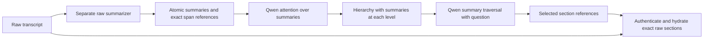

# Qwen summary hierarchy and exact section hydration

**Status**: Implemented as an opt-in retrieval path; matched accuracy and corpus-scale timing unmeasured
**Date**: 2026-09-08
**Applies to**: `perf/durable-ingest-pipeline`, `.worktrees/ingest-speed`
**Depends on**: [Research Log 121](121%20-%202026-09-08%20-%20r9%20reduced30%20execution%20handoff.md), [Research Log 120](120%20-%202026-09-08%20-%20Fact-reserved%20episodic%20packet%20repair.md)

## Decision and implementation

The continuation requested by the user is **attention-guided hierarchical
chunking and summary-based section routing with exact raw-section hydration**.
Qwen may process the hierarchical summaries and the retrieval question. It
must not process raw transcript content during chunk formation or routing.

The implemented path separates those capabilities:



1. `compile_attention_atoms` forms lossless UTF-8-safe raw slices under a
   token cap, then invokes the explicitly separate `summarize_raw` callback.
   Use a non-Qwen summarizer, such as the existing local LFM runtime. Loading
   precomputed atomic `SectionSummary` descriptors is also supported.
2. `build_attention_section_hierarchy` accepts only those summary descriptors.
   It has no raw reader and does not accept `Turn` inputs. The existing
   `QwenAttentionHeadSurpriseScorer` sees only atomic summary strings under its
   neutral, question-independent probe. Adjacent normalized OV-transport cosine
   change guides recursive contiguous splits. Scoring windows overlap by one
   atom to measure every boundary. Within the middle half of an oversized
   range, the strongest change determines the split; center proximity and then
   earlier position break ties. The balance restriction bounds tree depth.
3. Leaf summaries consume atomic summaries; parent summaries consume their
   child summaries through `summarize_summaries`. This callback never receives
   raw content. Each source owns an independent tree. Children must partition
   their parent's exact spans in order.
4. `route_summary_hierarchy` uses the existing Qwen `inspect_nested` QK/OV
   attention scorer. It selects root summaries and repeatedly expands selected
   branches. Only summaries become candidate text; source IDs, hashes and
   character coordinates stay outside the model prompt. The query is the
   attention probe. Leaves compete alongside newly expanded children under the
   same section cap. At the depth cap, the route retains whole internal sections.
5. `MemoryCondenser.search_attention_summary_sections` completes routing before
   it gives the resulting plan to the transcript hydrator. Hydration checks the
   exact source, turn ID, role, timestamp, complete turn hash and slice hash.
   Missing or stale members reject the entire affected section. Span and context
   budgets also admit or reject whole sections. Contiguous slices from the same
   turn are rejoined without adding characters inside the raw text.

This uses the repository's Qwen3-8B attention prefix. The signal is semantic
change in summary attention transport; it is not token-NLL surprise or a
generated chain of thought. No transport vectors, token activations or KV cache
are included in the persistent hierarchy or route plan. Receipts retain model
identity, summary/span bindings, cut scores, selected IDs and work counters.

`search_summary_sections` provides a separate BM25 summary control. It is not
the requested Qwen route. Existing raw retrieval methods and sealed r9 artifacts
remain separate from this opt-in implementation.

## API and defaults

Implementation files:

- `src/memory_condense/search/section_summary.py`: immutable summary/span descriptors and optional section compilers.
- `src/memory_condense/search/episodes/attention_hierarchy.py`: raw atomic compilation and summary-only attention hierarchy construction.
- `src/memory_condense/search/section_routing.py`: serializable summary forest, route receipts and BM25 control.
- `src/memory_condense/search/section_attention.py`: Qwen traversal without transcript access.
- `src/memory_condense/application/section_retrieval.py`: authenticated, atomic raw hydration and rendering.
- `src/memory_condense/application/retrieval_workflow.py`: public condenser retrieval methods.

The builder defaults are 64 raw tokens per compilation atom, 512 raw tokens per
retrieved leaf, 64 tokens per summary and 128 atoms per attention window.
These token budgets use the repository tokenizer proxy; Qwen also enforces its
own workspace tokenizer limit. Retrieval defaults to four sections, at most 32
hierarchy rounds, 32 raw span attempts and a 4,096-token rendered context.
Oversized Qwen workspaces raise before raw hydration; they are never silently
truncated by this adapter.

```python
from memory_condense.search.episodes.attention_hierarchy import (
    compile_attention_atoms, build_attention_section_hierarchy,
)
from memory_condense.search.episodes.qwen_episode_signal import QwenAttentionHeadSurpriseScorer
from memory_condense.search.section_routing import SectionSummaryIndex

# Before query time: lfm_summary is a separately configured local summarizer.
# Both callbacks must return compact summaries within the declared token cap.
atoms = compile_attention_atoms(
    turns, summarize_raw=lfm_summary,
    summarizer_identity=lfm_checkpoint_and_prompt_identity,
)
hierarchy = build_attention_section_hierarchy(
    atoms, scorer=QwenAttentionHeadSurpriseScorer(qwen_linker),
    summarize_summaries=lfm_summary,
    summarizer_identity=lfm_checkpoint_and_prompt_identity,
)
saved_index = hierarchy.summary_index().to_json()

# After restart: Qwen receives only the stored summaries and this question.
result = condenser.search_attention_summary_sections(
    question, SectionSummaryIndex.from_json(saved_index), linker=qwen_linker,
)
raw_context = result.render_context()
```

The caller persists the JSON snapshot and supplies its raw summarizer; there is
no automatic full-store summary generation or ingest hook in this change.
Summaries carry routing authority only. `frontier_closed` is always false.
Hydration diagnostics and `requires_raw_fallback` expose missing, stale and
over-budget sections; successful hydration does not certify semantic recall.

## Verification

The focused section/attention suite passed **46 tests**. The integration suite
passed **267 tests** in 52.68 seconds, including existing condenser, retrieval,
Qwen signal, Qwen early-exit and conversation-envelope behavior:

```powershell
.\.pixi\envs\dev\python.exe -X utf8 -m pytest tests/test_attention_summary_sections.py tests/test_summary_section_routing.py tests/test_qwen_episode_signals.py tests/test_qwen_memory_linker_early_exit.py tests/test_condenser.py tests/test_retrieval.py tests/test_conversation_envelope_retrieval.py -q --basetemp .tmp-pytest-attention-summary-integration-r1
```

Tests inspect Qwen inputs, pin an attention-driven topic boundary and the
overlapping scoring seam, verify exact Unicode/CRLF reconstruction, restart the
summary index, hydrate only selected turns, enforce exact source scope and reject
invalid Qwen selections before any raw read. Separate tests cover whole-section
failure on stale text, source, role, timestamp or missing members.

`tools/assay_attention_summary_sections.py` is the local real-Qwen mechanism
smoke. It uses four synthetic raw turns and precomputed summaries; parent
summaries use bounded concatenation in this fixture. It does not measure LFM
summary quality or answer accuracy. The profiler observes actual Qwen linker
inputs without replacing the runtime, and the report binds the implementation,
checkpoint, hierarchy, routing rounds and exact raw reads.

```powershell
.\.pixi\envs\dev\python.exe -X utf8 tools/assay_attention_summary_sections.py --qwen-model-dir F:\Keytone\Documents\GitHub\memory_condense\.cache\models\Qwen3-8B --output-dir eval_results/attention-summary-sections-local-smoke-20260908-r2
```

Each execution requires a new output directory. The first smoke completed its
model operations but failed while reporting a misnamed counter; r2 corrects that
reporting error. The verified r2 report is
`eval_results/attention-summary-sections-local-smoke-20260908-r2/report.json`,
SHA-256 `a28f1681483ac730d7333b2ca262908f1b9587597deb8c0b546597730f940c8d`.
Every implementation file hash in the report matched the final source files.

The pinned six-layer Qwen3-8B prefix (attention layer 5) completed six forward
workspaces: two boundary windows and four passes across two routing rounds.
The input audit observed **zero raw-content inputs** and **zero external provider
calls**. Only after routing, hydration read `turn-0` and `turn-1` and rendered
their exact text in a 72-token packet. The three-node hierarchy and summary
snapshot round-tripped successfully. Total elapsed time was 18.154 seconds,
including 17.044 seconds loading the model; this small smoke is not a corpus
latency measurement. Checkpoint manifest SHA:
`76273516aa6924b12344d5e83daa485b66459b663c745cb3b9ef51cc17c7440d`.

**Observed routing miss:** for “When can I visit the observatory?”, this prefix
selected the orchard-summary leaf. The input-boundary and exact-hydration checks
passed, but this is negative evidence about semantic branch selection. The
fixture was not used to tune attention layers, scoring or prompts. Treat this
as an experimental mechanism requiring routing-quality work before promotion.

## Earlier r9 continuation retained separately

Before the scope was clarified, a temporal-reference candidate was built and
replayed at
`eval_results/longmemeval-1m-hot-temporal-reference-chain-reduced30-20260908-r1`.
Its selection SHA is
`d84a2aaf5cd572ad79d3a7f380ad4ed26a575b5b182b900d6a6620467d7f9aeb`.
It changes three selected packets and leaves 27 unchanged. Its 22 focused tests
and the 107-test parent suite passed together (129 tests). After the user
authorized the local gateways, its prepared evaluation completed at **12/30**,
with zero-call replay of both answer and judge artifacts. The r9 parent remains
at 11/30. This is a separate candidate, not the summary hierarchy implementation;
see [Research Log 123](123%20-%202026-09-08%20-%20Authorized%20temporal%20reference%20chain%20reduced30%20result.md)
for the paired verdicts and the observed variation on unchanged prompts.

Automatic approval review initially rejected the successor answer evaluation
because it lacked specific authorization for sending the locked questions and
private evidence to `https://central-dev.zt:4000/v1`. That attempted process did
not start. The user subsequently clarified, **“Those are local gateways, you
have authorization.”** The gateway and evaluation payload are now explicitly
authorized in this session; the earlier approval blocker is resolved. The
prepared temporal-reference answer/judge lifecycle completed using its sealed
preflight. Qwen summary attention remains a separate experiment.

## Open work in priority order

1. Compile and persist query-independent summaries for a corpus-scale candidate
   using a separately identified summarizer; measure construction cost and
   summary loss. The local smoke uses precomputed summaries only.
2. Investigate the observed semantic branch-selection miss on an independently
   defined diagnostic set, then compare Qwen hierarchy routing against the BM25 summary control and the
   protected raw path with the same section/context budgets. Measure exact
   evidence retention, raw I/O, attention workspaces and latency before promotion.
3. Run a separately sealed summary-routing answer/judge evaluation through the
   already authorized local gateways. No matched accuracy improvement or
   full100 promotion is established by this implementation.
